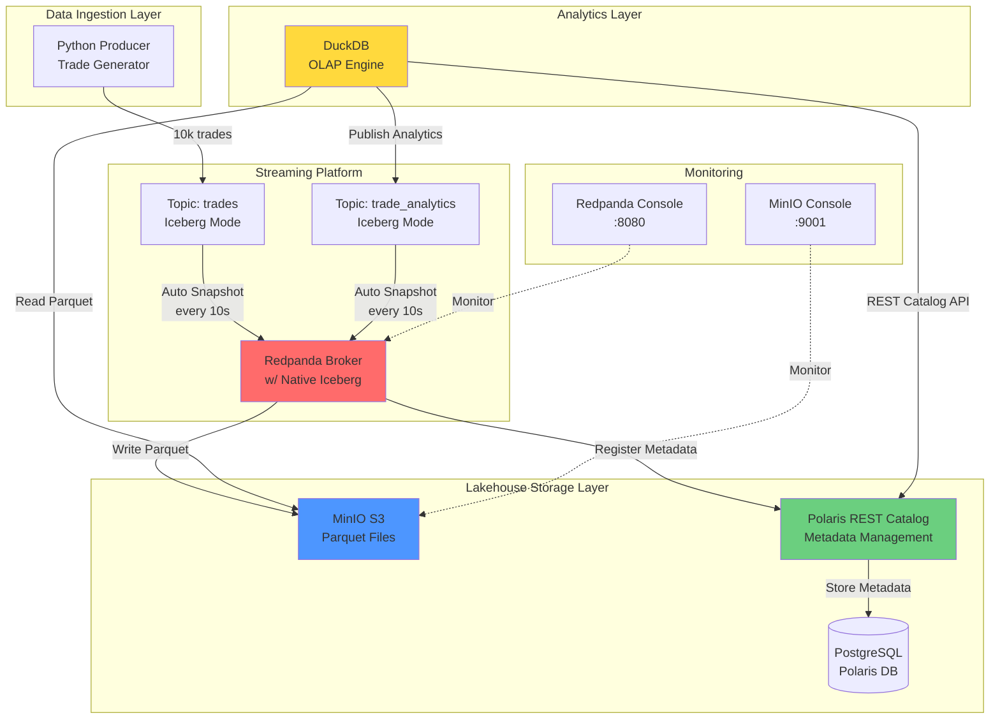
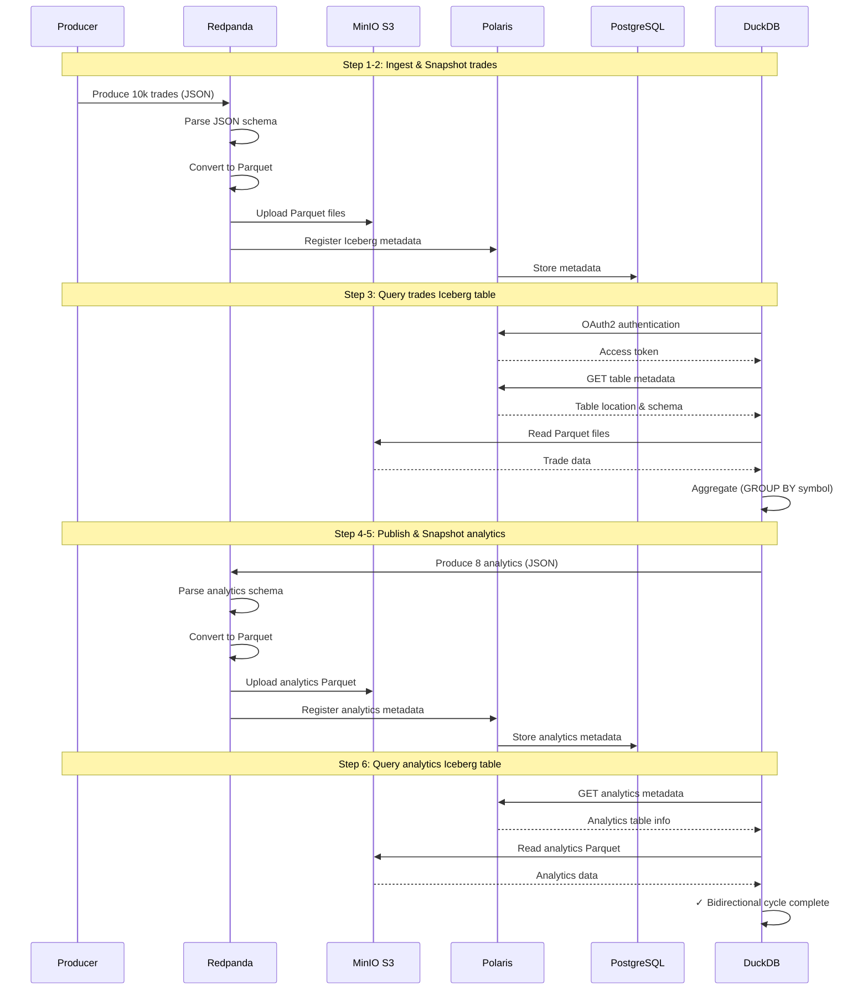
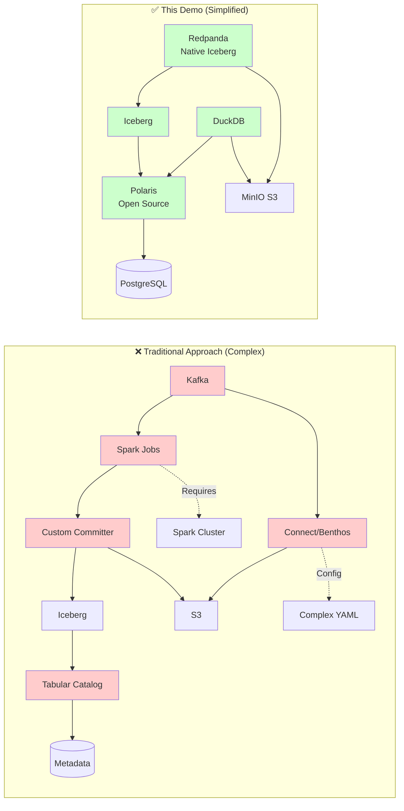
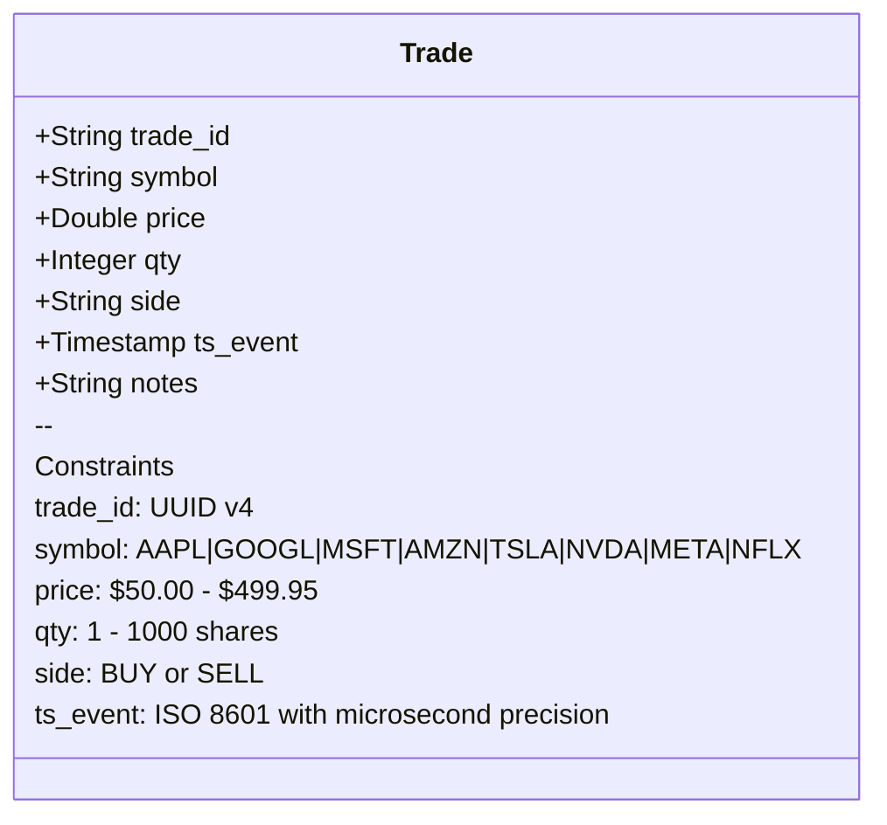
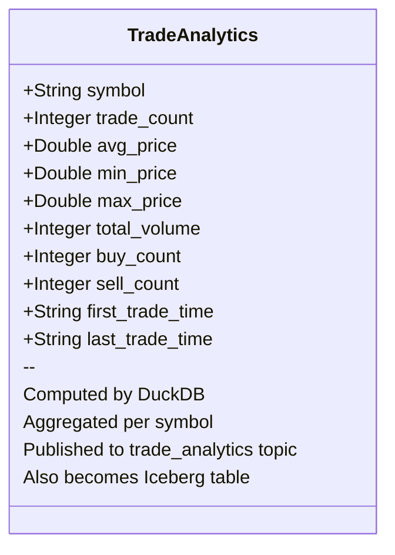
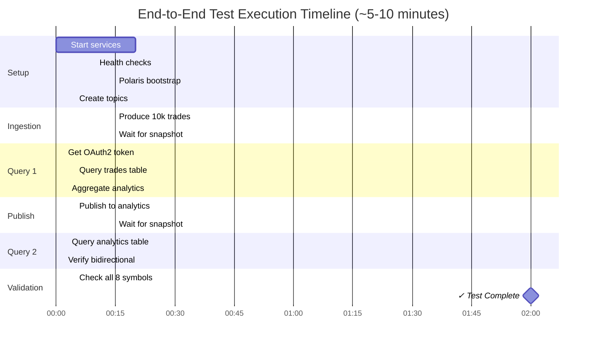

# Redpanda Iceberg Topics → DuckDB → Redpanda: Simplified Lakehouse Pipeline

> **A fully Dockerized streaming lakehouse pipeline** demonstrating Redpanda's native Iceberg integration with Polaris REST catalog and DuckDB analytics.

[](https://choosealicense.com/licenses/mit/)
[](./validation/e2e.sh)
[](https://www.docker.com/)
[](https://redpanda.com/)
[](https://duckdb.org/)

---

## 📊 Architecture Overview

### High-Level Ecosystem



### Bidirectional Data Flow

```
┌──────────────────────────────────────────────────────────────────────────┐
│                   COMPLETE BIDIRECTIONAL ICEBERG CYCLE                    │
│              Kafka → Iceberg → DuckDB → Kafka → Iceberg → DuckDB         │
└──────────────────────────────────────────────────────────────────────────┘

    ┌─────────────┐
    │  Producer   │  Generate deterministic trade data
    │   (Python)  │  • 10,000 trades
    └──────┬──────┘  • 8 stock symbols (AAPL, GOOGL, etc.)
           │         • Fixed seed for reproducibility
           │
           ▼
    ┌──────────────────────────┐
    │  Redpanda Iceberg Topic  │  Step 1: Ingest to Kafka
    │     "trades"             │─────────────────────────────┐
    │  mode: value_schema      │  Redpanda automatically:   │
    └──────────────────────────┘  • Parses JSON schema      │
           │                      • Flattens to columns     │
           │                      • Converts to Parquet     │
           │ Auto Snapshot        • Uploads to S3           │
           │ (every 10s)          • Registers in Polaris    │
           ▼                                                 │
    ┌─────────────────────────────┐                         │
    │  Iceberg Table: trades      │◄────────────────────────┘
    │  • S3: Parquet files        │  Step 2: Automatic Iceberg Table
    │  • Polaris: Metadata        │
    └──────┬──────────────────────┘
           │
           │ DuckDB connects via REST API
           ▼
    ┌──────────────────────────┐
    │   DuckDB OLAP Engine     │  Step 3: Query & Aggregate
    │  • OAuth2 auth           │  • GROUP BY symbol
    │  • Read Parquet from S3  │  • Compute avg/min/max price
    │  • Aggregate analytics   │  • Count BUY/SELL trades
    └──────┬───────────────────┘  • Sum volumes
           │
           │ Publish results back to Redpanda
           ▼
    ┌──────────────────────────┐
    │  Redpanda Iceberg Topic  │  Step 4: Analytics → Kafka
    │   "trade_analytics"      │─────────────────────────────┐
    │  mode: value_schema      │  Redpanda automatically:   │
    └──────────────────────────┘  • Creates Iceberg table   │
           │                      • 8 analytics records     │
           │ Auto Snapshot                                   │
           │ (every 10s)                                     │
           ▼                                                 │
    ┌─────────────────────────────┐                         │
    │  Iceberg Table: analytics   │◄────────────────────────┘
    │  • S3: Parquet files        │  Step 5: Second Iceberg Table
    │  • Polaris: Metadata        │
    └──────┬──────────────────────┘
           │
           │ DuckDB can query again!
           ▼
    ┌──────────────────────────┐
    │   Query Analytics Table  │  Step 6: Complete Cycle
    │  FROM iceberg_catalog    │  ✓ Bidirectional flow proven
    │   .redpanda.analytics    │
    └──────────────────────────┘
```

### Component Interaction Sequence



### Technology Stack

```
┌──────────────────────────────────────────────────────────────┐
│                      TECHNOLOGY LAYERS                        │
└──────────────────────────────────────────────────────────────┘

📊 ANALYTICS LAYER
    ┌──────────────────────────────────────┐
    │  DuckDB v1.4.1                       │  OLAP Analytics Engine
    │  • Iceberg extension                 │  • Fast columnar queries
    │  • httpfs extension (S3 access)      │  • In-memory processing
    │  • Python API (confluent-kafka)      │  • REST catalog support
    └──────────────────────────────────────┘

🌊 STREAMING LAYER
    ┌──────────────────────────────────────┐
    │  Redpanda v25.2.2                    │  Kafka API Compatible
    │  • Native Iceberg Topics             │  • Zero-latency streaming
    │  • Auto Parquet conversion           │  • Schema Registry
    │  • 10s snapshot interval             │  • Cloud storage tiering
    └──────────────────────────────────────┘

📚 CATALOG LAYER
    ┌──────────────────────────────────────┐
    │  Apache Polaris (latest)             │  Iceberg REST Catalog
    │  • OAuth2 authentication             │  • Open-source
    │  • RBAC for tables/namespaces        │  • Multi-catalog support
    │  • PostgreSQL metadata store         │  • Standard REST API
    └──────────────────────────────────────┘

💾 STORAGE LAYER
    ┌────────────────────┐  ┌─────────────────────────┐
    │  MinIO (S3 API)    │  │  PostgreSQL 15          │
    │  • Parquet files   │  │  • Polaris metadata     │
    │  • Path-style URLs │  │  • ACID transactions    │
    │  • Versioned       │  │  • High availability    │
    └────────────────────┘  └─────────────────────────┘

🎯 APPLICATION LAYER
    ┌────────────────────┐  ┌─────────────────────────┐
    │  Python Producer   │  │  Redpanda Console       │
    │  • Deterministic   │  │  • Topic monitoring     │
    │  • Seeded RNG      │  │  • Schema visualization │
    │  • JSON output     │  │  • Consumer lag         │
    └────────────────────┘  └─────────────────────────┘
```

---

## 🎯 What This Demo Shows

This project demonstrates a **simplified lakehouse architecture** using Redpanda's native Iceberg integration:

### Architecture Simplification



### Component Comparison

| Aspect | Traditional (7+ services) | This Demo (5 services) |
|--------|---------------------------|------------------------|
| **Iceberg Integration** | Custom Python committer service | ✅ Native Redpanda feature |
| **Data Movement** | Redpanda Connect + YAML config | ✅ Built-in (topic config) |
| **Processing Engine** | Apache Spark cluster | ✅ Not needed |
| **Catalog** | Tabular (proprietary) | ✅ Polaris (open-source) |
| **Snapshot Creation** | Manual polling + conversion | ✅ Automatic (every 10s) |
| **Complexity** | High (multiple moving parts) | ✅ Low (native integration) |
| **Setup Time** | 30-60 minutes | ✅ 5-10 minutes |

### Key Simplifications

❌ **Removed Components:**
- No Spark cluster or jobs
- No custom committer service
- No Redpanda Connect/Benthos
- No complex YAML configurations
- No Tabular catalog subscription

✅ **Simplified Stack:**
- **Redpanda** with native Iceberg Topics feature
- **Apache Polaris** - Open-source Iceberg REST catalog
- **PostgreSQL** - Polaris metadata storage
- **MinIO** - S3-compatible object storage
- **DuckDB** - Fast analytical queries via REST catalog

### Real-World Use Cases

```mermaid
graph TD
    subgraph "Financial Trading Platform"
        T1[Trade Execution System] -->|Real-time trades| RP1[Redpanda Iceberg Topic]
        RP1 --> IC1[Iceberg Table: trades]
        IC1 --> AN1[DuckDB Analytics]
        AN1 -->|Risk metrics| RP2[Analytics Topic]
        RP2 --> DASH1[Risk Dashboard]
        RP2 --> ALERT1[Alert System]
    end

    subgraph "IoT Sensor Network"
        IOT[IoT Devices] -->|Sensor readings| RP3[Redpanda Iceberg Topic]
        RP3 --> IC2[Iceberg Table: sensors]
        IC2 --> AN2[DuckDB Analytics]
        AN2 -->|Anomaly detection| RP4[Alerts Topic]
        RP4 --> ML[ML Pipeline]
        RP4 --> OPS[Operations Console]
    end

    subgraph "E-commerce Platform"
        WEB[Web Traffic] -->|Clickstream| RP5[Redpanda Iceberg Topic]
        RP5 --> IC3[Iceberg Table: events]
        IC3 --> AN3[DuckDB Analytics]
        AN3 -->|User segments| RP6[Segments Topic]
        RP6 --> REC[Recommendation Engine]
        RP6 --> BI[BI Dashboard]
    end

    style RP1 fill:#ff6b6b
    style RP3 fill:#ff6b6b
    style RP5 fill:#ff6b6b
    style AN1 fill:#ffd93d
    style AN2 fill:#ffd93d
    style AN3 fill:#ffd93d
```



**This Demo Implements: Financial Trading Platform Pattern**
- Ingest raw financial trade data
- Redpanda automatically creates Iceberg tables
- Query with DuckDB via REST catalog
- Publish insights for real-time monitoring dashboards, alerting systems, and downstream microservices

---

## 🚀 Quick Start

### Prerequisites
- Docker & Docker Compose installed
- 8GB RAM minimum
- ~5-10 minutes for full end-to-end test

### Run the Complete Pipeline

```bash
# Clone and navigate
cd redpanda-iceberg-duckdb

# Run end-to-end test (builds containers, starts services, runs full workflow)
./validation/e2e.sh
```

**What the script does:**
1. ✅ Starts all services (Redpanda, Polaris, MinIO, PostgreSQL, DuckDB)
2. ✅ Creates TWO Redpanda topics with `redpanda.iceberg.mode=value_schema_latest`
3. ✅ Registers JSON schemas for both trade and analytics data
4. ✅ Produces 10,000 deterministic trade records
5. ✅ Waits for Redpanda to create `trades` Iceberg table (automatic)
6. ✅ Queries `trades` Iceberg table with DuckDB via Polaris REST catalog
7. ✅ Publishes aggregated results to `trade_analytics` topic (also Iceberg-enabled)
8. ✅ Waits for Redpanda to create `trade_analytics` Iceberg table
9. ✅ Queries `trade_analytics` Iceberg table (completing bidirectional cycle!)

**Expected Output:**
```
=== End-to-End Test PASSED ===
✓ Data successfully flowed through BIDIRECTIONAL Iceberg pipeline:
  1. Producer → Redpanda (trades topic with Iceberg mode)
  2. Redpanda → trades Iceberg table (automatic snapshots)
  3. DuckDB → Query trades Iceberg table via REST catalog
  4. DuckDB → Publish analytics to Redpanda (trade_analytics topic with Iceberg mode)
  5. Redpanda → trade_analytics Iceberg table (automatic snapshots)
  6. DuckDB → Query analytics Iceberg table (complete cycle!)

Bidirectional Iceberg Flow Demonstrated:
  ✓ Kafka → Iceberg → DuckDB → Kafka → Iceberg → DuckDB
  ✓ Both directions use native Redpanda Iceberg Topics
  ✓ All data queryable via Polaris REST catalog
```

---

## 📋 Manual Step-by-Step

### 1. Start Services

```bash
# Build DuckDB container
docker compose build duckdb-cli

# Start all services
docker compose up -d

# Wait for services to be ready (~20 seconds)
docker compose ps
```

### 2. Create Topic with Iceberg Mode

```bash
# Create topic with Iceberg integration
docker compose exec redpanda rpk topic create trades \
    --partitions 1 \
    --replicas 1 \
    --topic-config=redpanda.iceberg.mode=value_schema_latest

# Register JSON schema
docker compose exec redpanda rpk registry schema create trades-value \
    --schema @/path/to/schema.json \
    --type json
```

### 3. Produce Data

```bash
# Produce 10,000 trades
docker compose run --rm producer \
    --brokers redpanda:9092 \
    --topic trades \
    --count 10000 \
    --seed 42
```

### 4. Wait for Iceberg Snapshot

```bash
# Redpanda creates snapshots automatically every 10 seconds
sleep 15
```

### 5. Query with DuckDB

```bash
# Generate DuckDB init script with OAuth2 token
docker compose exec duckdb-cli /workspace/duckdb/get_token.sh

# Query Iceberg table via REST catalog
docker compose exec duckdb-cli duckdb -init /workspace/duckdb/init-env.sql -c "
SELECT symbol, COUNT(*) as trades, AVG(price) as avg_price
FROM iceberg_catalog.redpanda.trades
GROUP BY symbol;
"
```

### 6. Publish Analytics

```bash
# Query and publish to Redpanda
docker compose exec \
    -e RP_BROKERS=redpanda:9092 \
    -e RP_TOPIC_RESULTS=trade_analytics \
    duckdb-cli python3 /workspace/duckdb/query_and_publish.py

# Verify results
docker compose exec redpanda rpk topic consume trade_analytics --num 8 --format json
```

---

## 🔧 Configuration

### Redpanda Iceberg Settings

Key cluster configurations (set via `--set` flags in docker-compose.yml):

```yaml
iceberg_enabled: true
iceberg_catalog_type: rest
iceberg_rest_catalog_endpoint: http://polaris:8181/api/catalog/
iceberg_rest_catalog_oauth2_server_uri: http://polaris:8181/api/catalog/v1/oauth/tokens
iceberg_rest_catalog_authentication_mode: oauth2
iceberg_rest_catalog_client_id: root
iceberg_rest_catalog_client_secret: pass
iceberg_rest_catalog_warehouse: redpanda_catalog
iceberg_target_lag_ms: 10000  # Snapshot every 10 seconds
```

### Iceberg Modes

Redpanda supports three Iceberg modes via `redpanda.iceberg.mode`:

1. **`key_value`** - Raw bytes stored as BLOB columns
2. **`value_schema_id_prefix`** - Avro encoded with schema ID prefix
3. **`value_schema_latest`** - JSON encoded with latest schema (used in this demo)

### DuckDB REST Catalog Connection

```sql
-- Create secret with OAuth2 token
CREATE SECRET iceberg_secret (
    TYPE ICEBERG,
    TOKEN '<polaris-oauth2-token>'
);

-- Attach Polaris catalog
ATTACH 'redpanda_catalog' AS iceberg_catalog (
    TYPE ICEBERG,
    SECRET iceberg_secret,
    ENDPOINT 'http://polaris:8181/api/catalog/'
);

-- Query tables
SELECT * FROM iceberg_catalog.redpanda.trades;
```

---

## 📁 Project Structure

```
redpanda-iceberg-duckdb/
├── docker-compose.yml              # Services orchestration
├── README.md                       # This file
├── CLAUDE.md                       # Developer guide
│
├── resources/
│   └── create-polaris-db.sql       # PostgreSQL initialization
│
├── validation/
│   └── e2e.sh                      # End-to-end test script
│
├── redpanda/
│   ├── Dockerfile
│   ├── producer.py                 # Trade data generator
│   └── requirements.txt
│
├── duckdb/
│   ├── init.sql                    # DuckDB REST catalog setup
│   ├── get_token.sh                # OAuth2 token helper
│   ├── verify_iceberg.sql          # Verification queries
│   └── query_and_publish.py        # Query + publish to Kafka
│
└── duckdb-ui/
    └── Dockerfile                  # DuckDB CLI with Python
```

---

## 📊 Data Schema

### Trade Data Schema (Input)



**JSON Schema (Registered in Schema Registry):**
```json
{
  "type": "object",
  "properties": {
    "trade_id": {"type": "string"},
    "symbol": {"type": "string"},
    "price": {"type": "number"},
    "qty": {"type": "integer"},
    "side": {"type": "string"},
    "ts_event": {"type": "string", "format": "date-time"},
    "notes": {"type": "string"}
  },
  "required": ["trade_id", "symbol", "price", "qty", "side", "ts_event"]
}
```

**Iceberg Table Columns (Auto-created by Redpanda):**
```
┌──────────────┬─────────────────┬─────────────────────────────┐
│ Column       │ Iceberg Type    │ Description                 │
├──────────────┼─────────────────┼─────────────────────────────┤
│ trade_id     │ string          │ UUID v4 identifier          │
│ symbol       │ string          │ Stock ticker (8 symbols)    │
│ price        │ double          │ Trade price                 │
│ qty          │ int             │ Quantity (shares)           │
│ side         │ string          │ BUY or SELL                 │
│ ts_event     │ timestamptz     │ Event timestamp (μs)        │
│ notes        │ string          │ Optional metadata           │
└──────────────┴─────────────────┴─────────────────────────────┘
```

### Analytics Data Schema (Output)



### Docker Networking

```
┌─────────────────────────────────────────────────────────────────┐
│                    Docker Network: lakehouse                     │
│                         (Bridge Mode)                            │
└─────────────────────────────────────────────────────────────────┘

    Internal DNS Resolution (all services resolve by name)

    ┌─────────────┐      ┌──────────────┐      ┌─────────────┐
    │  redpanda   │◄────►│   polaris    │◄────►│  postgres   │
    │   :9092     │      │   :8181      │      │   :5432     │
    └──────┬──────┘      └──────┬───────┘      └─────────────┘
           │                    │
           │                    │
           ▼                    ▼
    ┌─────────────┐      ┌──────────────┐      ┌─────────────┐
    │   minio     │      │  duckdb-cli  │      │   console   │
    │   :9000     │      │   (Python)   │      │   :8080     │
    └─────────────┘      └──────────────┘      └─────────────┘

    Port Mappings (host:container)
    ┌────────────────────────────────────────────────────────┐
    │  • localhost:19092 → redpanda:9092  (Kafka API)       │
    │  • localhost:18081 → redpanda:8081  (Schema Registry) │
    │  • localhost:8181  → polaris:8181   (REST Catalog)    │
    │  • localhost:9000  → minio:9000     (S3 API)          │
    │  • localhost:9001  → minio:9001     (MinIO Console)   │
    │  • localhost:8080  → console:8080   (Redpanda UI)     │
    │  • localhost:5432  → postgres:5432  (PostgreSQL)      │
    └────────────────────────────────────────────────────────┘
```

---

## 🔍 Monitoring & Debugging

### Access Web UIs

- **Redpanda Console:** http://localhost:8080
- **MinIO Console:** http://localhost:9001 (login: `minioadmin` / `minioadmin`)
- **Polaris API:** http://localhost:8181

### Check Service Logs

```bash
# Redpanda logs (shows Iceberg snapshot creation)
docker compose logs -f redpanda

# Polaris logs
docker compose logs -f polaris

# DuckDB container
docker compose logs -f duckdb-cli
```

### Query Polaris Catalog

```bash
# Get OAuth2 token
TOKEN=$(curl -s -X POST http://localhost:8181/api/catalog/v1/oauth/tokens \
  -H "Content-Type: application/x-www-form-urlencoded" \
  -d "grant_type=client_credentials&client_id=root&client_secret=pass&scope=PRINCIPAL_ROLE:ALL" \
  | jq -r '.access_token')

# List catalogs
curl -s http://localhost:8181/api/management/v1/catalogs \
  -H "Authorization: Bearer $TOKEN" | jq

# List namespaces in catalog
curl -s http://localhost:8181/api/catalog/v1/redpanda_catalog/namespaces \
  -H "Authorization: Bearer $TOKEN" | jq

# List tables
curl -s http://localhost:8181/api/catalog/v1/redpanda_catalog/namespaces/redpanda/tables \
  -H "Authorization: Bearer $TOKEN" | jq
```

---

## 🐛 Troubleshooting

### Token Expired

If DuckDB queries fail with "token expired":

```bash
docker compose exec duckdb-cli /workspace/duckdb/get_token.sh
```

### No Data in Iceberg Table

Check that Iceberg snapshots are being created:

```bash
# Check Redpanda logs for "iceberg" messages
docker compose logs redpanda | grep -i iceberg

# Verify files in MinIO
docker compose exec -it minio-init mc ls myminio/redpanda --recursive
```

### Polaris Connection Issues

```bash
# Check Polaris is healthy
curl http://localhost:8181/healthcheck

# Check PostgreSQL is running
docker compose exec postgres psql -U polaris -d polaris -c "\dt"
```

---

## 🧹 Clean Up

```bash
# Stop all services and remove volumes
docker compose down -v

# Remove generated files
rm -f duckdb/init-env.sql
```

---

## ✨ Key Features

### Core Capabilities

```
┌────────────────────────────────────────────────────────────────┐
│                     FEATURE HIGHLIGHTS                         │
└────────────────────────────────────────────────────────────────┘

🔄 BIDIRECTIONAL ICEBERG FLOW
    ├─ Kafka → Iceberg → DuckDB (forward path)
    └─ DuckDB → Kafka → Iceberg (return path)
    ✓ Complete round-trip demonstrated

⚡ NATIVE ICEBERG INTEGRATION
    ├─ No custom services required
    ├─ Redpanda handles conversion automatically
    ├─ JSON → Parquet in real-time
    └─ Automatic metadata registration
    ✓ Zero manual intervention

📊 DUAL ICEBERG TABLES
    ├─ Table 1: trades (10,000 records)
    └─ Table 2: trade_analytics (8 aggregates)
    ✓ Both queryable via REST catalog

🎯 STANDARD REST CATALOG
    ├─ Apache Polaris (open-source)
    ├─ OAuth2 authentication
    ├─ RBAC for access control
    └─ PostgreSQL metadata storage
    ✓ Production-ready catalog

⏱️ AUTOMATIC SNAPSHOTS
    ├─ Configurable interval (10s default)
    ├─ No manual triggering needed
    ├─ Atomic commits to Iceberg
    └─ ACID guarantees maintained
    ✓ Set-and-forget operation

🚀 DUCKDB ANALYTICS
    ├─ Sub-second query performance
    ├─ Direct Parquet reads from S3
    ├─ In-memory aggregations
    └─ Kafka producer integration
    ✓ Fast analytical processing

🧪 DETERMINISTIC TESTING
    ├─ Fixed seed (42) for reproducibility
    ├─ Same data every run
    ├─ End-to-end verification
    └─ Automated test suite
    ✓ Reliable CI/CD integration

🐳 FULLY DOCKERIZED
    ├─ No local installation needed
    ├─ Self-contained environment
    ├─ Health checks for all services
    └─ One command startup
    ✓ Works anywhere Docker runs
```

### E2E Test Flow Timeline



---

## 🎓 Learn More

### Documentation

- **[Redpanda Iceberg Topics](https://docs.redpanda.com/current/manage/iceberg/about-iceberg-topics/)** - Native Iceberg integration
- **[Apache Polaris](https://polaris.apache.org/)** - Open-source Iceberg REST catalog
- **[DuckDB Iceberg Extension](https://duckdb.org/docs/stable/core_extensions/iceberg/iceberg_rest_catalogs)** - REST catalog support
- **[Apache Iceberg](https://iceberg.apache.org/)** - Table format specification

### Related Resources

- [Redpanda with Snowflake Polaris](https://docs.redpanda.com/current/manage/iceberg/redpanda-topics-iceberg-snowflake-catalog/)
- [Reference Implementation](https://github.com/pmw-rp/iceberg-demo) - Kubernetes-based demo

---

## 🤝 Contributing

This is a demo project for educational purposes. Feel free to:
- Open issues for bugs or questions
- Submit PRs for improvements
- Use as a template for your own projects

---

## 📄 License

MIT License - See [LICENSE](LICENSE) for details.

---

## 🙏 Acknowledgments

**Built with Claude Code** - Demonstrating modern lakehouse architecture with Redpanda's native Iceberg integration.

Special thanks to the teams behind Redpanda, Apache Iceberg, Apache Polaris, and DuckDB.

---

<p align="center">
  <b>⭐ If you find this useful, please star the repository! ⭐</b>
</p>
